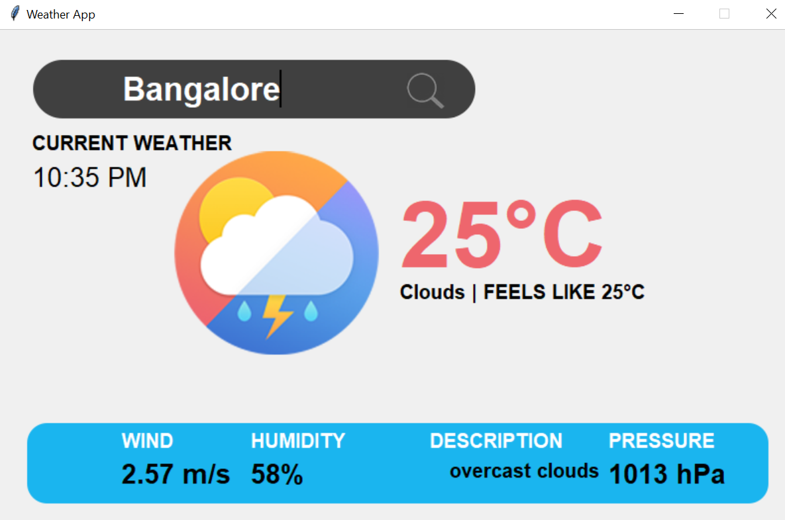

# Weather App

A simple GUI-based weather application built using Python and Tkinter that fetches real-time weather data using the OpenWeatherMap API.

## Features

- Fetch current weather data for any city.
- Display temperature, weather condition, wind speed, humidity, and pressure.
- Uses `geopy` and `timezonefinder` to determine the location and timezone.
- Displays current local time of the selected city.
- Simple and user-friendly graphical interface.

## Technologies Used

- Python 3
- Tkinter (for GUI)
- Geopy (for location services)
- TimezoneFinder (for timezone detection)
- Requests (for API calls)
- OpenWeatherMap API (for weather data)
- Pytz (for timezone handling)

## Installation

### Prerequisites
Make sure you have Python installed on your system. You can download it from [Python Official Website](https://www.python.org/).

### Install Required Libraries
Run the following command to install dependencies:

```sh
pip install tkinter geopy timezonefinder requests pytz
```

## Usage

1. Clone this repository or copy the `weather_app.py` file.
2. Replace the `api_key` in the script with your own OpenWeatherMap API key.
3. Run the script:

```sh
python weather_app.py
```

4. Enter a city name in the search bar and click the search button to retrieve weather information.

## Screenshots

  
_Add an actual screenshot of your app here._

## Notes

- Ensure that you have a valid API key from [OpenWeatherMap](https://openweathermap.org/) to fetch weather data.
- The app requires an internet connection to retrieve real-time weather information.

## License

This project is open-source and free to use. Feel free to modify and enhance it as needed.

## Credits

- Developed by: Annesha Panda
- OpenWeatherMap API for weather data
- Geopy and TimezoneFinder for location services
